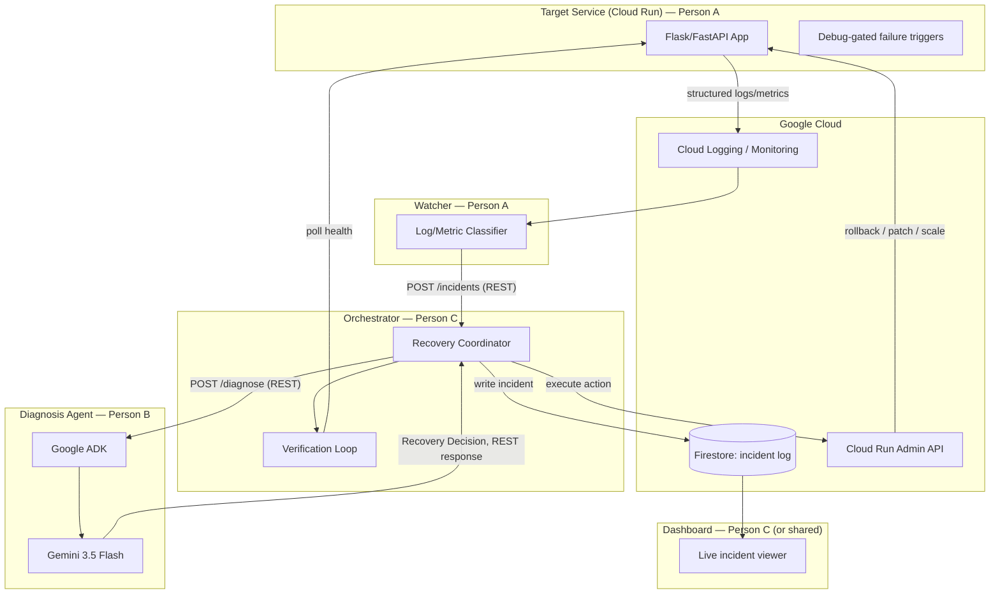
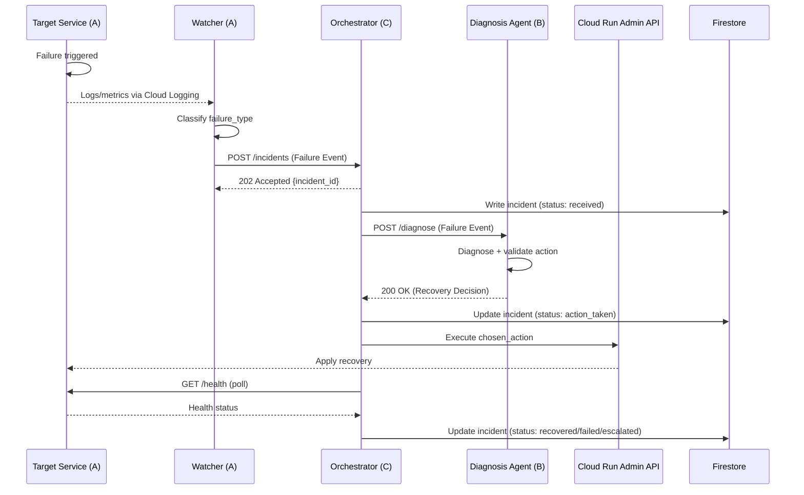

# AutoMend — Final Team Briefing

This is the single source of truth for what to build, who talks to whom, and exactly what every API call looks like. Read your own section fully before writing code. Read the API Contract Reference (§4) regardless of your role — it's short, and it's the only thing that has to stay identical across all three of you.

**Deadline:** built project + demo video due September 1, 5AM.
**Team:** Person A (Target Service & Watcher), Person B (Diagnosis Agent), Person C (Orchestrator, infra, reporting) — this document is you, Hanan.

---

## 1. The system in one paragraph
A small backend app (Target Service) runs on Cloud Run and can be made to fail on demand. A Watcher checks its logs/metrics from the outside and, on detecting a failure, calls the Orchestrator directly over REST. The Orchestrator asks the Diagnosis Agent (Gemini via ADK) what's wrong and what to do about it, then actually carries out the fix using the Cloud Run Admin API, checks that it worked, and logs everything to Firestore. A dashboard reads that log in real time. There is no message broker anywhere — every hop is a direct HTTP call.

---

## 2. Architecture Diagram



---

## 3. Sequence of a Single Incident



---

## 4. API Contract Reference (read this regardless of your role)

Every API call in the system, in one place. This is the only thing that must stay byte-identical across all three of you — if you need to change a field, say so in the group chat before changing it, not after.

### 4.1 `POST /incidents`
**Caller:** Watcher (A) → **Receiver:** Orchestrator (C)
**Auth:** Cloud Run ID token; Watcher's service account needs `roles/run.invoker` on the Orchestrator service.
**Purpose:** report a detected failure.

Request body (the **Failure Event**):
```json
{
  "service_id": "string",
  "revision_id": "string",
  "timestamp": "ISO8601",
  "failure_type": "crash_loop | error_rate_spike | memory_leak | bad_deploy | health_check_failure | dependency_failure",
  "log_snippet": "string (last ~50 lines)",
  "metrics": {
    "error_rate": 0.0,
    "memory_mb": 0,
    "restart_count": 0
  },
  "last_known_good_revision": "string"
}
```

Response (`202 Accepted`):
```json
{
  "incident_id": "string",
  "status": "received"
}
```

Notes for A: retry this call with backoff on network failure or non-2xx response — there's no broker to guarantee delivery for you.
Notes for C: this endpoint should return fast (just persist and return `incident_id`) — do the actual diagnosis/recovery work after responding, not before, so the Watcher isn't blocked.

### 4.2 `POST /diagnose`
**Caller:** Orchestrator (C) → **Receiver:** Diagnosis Agent (B)
**Auth:** Cloud Run ID token; Orchestrator's service account needs `roles/run.invoker` on the Diagnosis Agent service.
**Purpose:** get a root-cause diagnosis and a recovery action for a given failure.

Request body: identical shape to the Failure Event above (C forwards what it received from A, unmodified).

Response (`200 OK`) — the **Recovery Decision**:
```json
{
  "service_id": "string",
  "diagnosed_cause": "string",
  "confidence": 0.0,
  "chosen_action": "rollback_to_last_good | patch_env_var | increase_memory_limit | restart_instance | scale_down_instance",
  "action_params": {
    "target_revision": "string",
    "env_key": "string",
    "env_value": "string",
    "memory_mb": 512
  },
  "reasoning": "string (1-2 sentences)"
}
```

Notes for B: `chosen_action` must always be one of the five listed values — never return anything else, even as an error case. If Gemini's raw output doesn't validate, apply your rule-based fallback *inside this endpoint* before responding, so the Orchestrator never has to know the model produced something invalid.
Notes for C: set a hard timeout on this call (a few seconds) with your own fallback action if it doesn't respond in time — don't let a slow diagnosis call stall the whole incident live.

### 4.3 `GET /health`
**Caller:** Orchestrator (C) → **Receiver:** Target Service (A)
**Auth:** none needed (Target Service is public, per its `--allow-unauthenticated` deploy).
**Purpose:** post-recovery verification polling.

Response (`200 OK` when healthy):
```json
{
  "status": "ok",
  "error_rate": 0.0,
  "memory_mb": 0
}
```
A non-200 or an unhealthy `status` value during the verification window means the recovery didn't work — mark the incident `failed`/`escalated`, don't retry automatically.

### 4.4 Debug-gated failure triggers (Target Service)
**Caller:** you, manually, during testing/demo → **Receiver:** Target Service (A)
**Auth:** none, but gated behind a debug flag so they're not live in a "real" deployment.
**Purpose:** make specific failures happen on demand for testing and the live demo.

Suggested endpoints (A finalizes exact paths/params):
- `POST /debug/error-spike` — start returning 500s
- `POST /debug/leak-memory` — allocate memory until OOM-killed
- `POST /debug/hang` — stall past the readiness probe timeout
- (bad_deploy is triggered by deploying a second, pre-built broken revision — not an endpoint)

### 4.5 Cloud Run Admin API calls
**Caller:** Orchestrator (C) → **Receiver:** Google Cloud Run Admin API (not a service any of you build)
**Auth:** Orchestrator's service account needs `roles/run.admin` (or a scoped custom role) on the target service.
**Purpose:** actually execute the recovery action.

This isn't a JSON contract between team members — it's Google's own API, called via the `google-cloud-run` Python client. C is responsible for translating each `chosen_action` value into the right call:
| `chosen_action` | Admin API operation |
|---|---|
| `rollback_to_last_good` | Update traffic split → 100% to `action_params.target_revision` |
| `patch_env_var` | Deploy new revision with `action_params.env_key`/`env_value` set |
| `increase_memory_limit` | Deploy new revision with updated memory limit (`action_params.memory_mb`) |
| `restart_instance` | Force a new revision deploy (same config, triggers fresh containers) |
| `scale_down_instance` | Update service min/max instance count |

### 4.6 Firestore writes
**Caller:** Orchestrator (C) only → **Receiver:** Firestore
**Purpose:** persist the incident lifecycle. Not called by A or B directly — they only ever talk to the Orchestrator over REST, never to Firestore.

Document shape (`services/{service_id}/incidents/{incident_id}`):
```
failure_event: map          # exact Failure Event payload received
recovery_decision: map      # exact Recovery Decision payload received
action_taken: map           # action + params actually executed
verification_result: map
outcome: "recovered" | "failed" | "escalated"
status: "received" | "diagnosing" | "action_taken" | "verifying" | "recovered" | "failed" | "escalated"
timestamps: map
```

### 4.7 Dashboard reads
**Caller:** Dashboard (static site) → **Receiver:** Firestore directly
**Auth:** Firebase read-only security rules — no write access from the dashboard.
**Purpose:** display incidents in real time. Not a REST call to any of your services — it's a direct Firestore listener via the Firebase JS SDK.

---

## 5. Person A — Target Service & Watcher

### What you own
The thing that breaks, and the thing that notices. You call the Orchestrator (§4.1); nothing calls you except the Orchestrator's health check (§4.3) and your own debug triggers (§4.4).

### Build checklist
- [ ] Flask/FastAPI Target Service on Cloud Run, structured JSON-line logging.
- [ ] `GET /health` endpoint returning current status/error-rate/memory (§4.3).
- [ ] Debug-gated failure trigger endpoints (§4.4).
- [ ] A second, pre-built broken revision ready to deploy on demand for the bad-deploy scenario.
- [ ] Watcher process reading Cloud Logging/Monitoring, classifying against the six `failure_type` values.
- [ ] Watcher calls `POST /incidents` (§4.1) with retry-with-backoff on failure.
- [ ] Watcher's service account granted `roles/run.invoker` on the Orchestrator.

### Two-day schedule (recap)
- **Day 1 AM:** build Target Service + all failure triggers, verify each manually.
- **Day 1 PM:** build Watcher, get it classifying correctly and calling `/incidents` (against C's real endpoint or a stub).
- **Day 2 AM:** prepare the broken-deploy revision, tighten detection timing for demo speed.
- **Day 2 PM:** full integration + failure-injection rehearsal with B and C.

---

## 6. Person B — Diagnosis Agent

### What you own
A single stateless endpoint. The Orchestrator calls you (§4.2); you call nothing and nobody else.

### Build checklist
- [ ] Google ADK + Gemini 3.5 Flash wired up.
- [ ] `POST /diagnose` endpoint (§4.2) accepting a Failure Event, returning a Recovery Decision via structured output/function-calling.
- [ ] Validation layer: reject any `chosen_action` outside the five-value enum, apply a deterministic rule-based fallback instead (never let an invalid response leave this endpoint).
- [ ] Reasonable response time (a few seconds) — C is setting a timeout on their end, so don't make them hit it.
- [ ] Your service account setup so the Orchestrator's service account can be granted `roles/run.invoker` on you.

### Two-day schedule (recap)
- **Day 1 AM:** ADK/Gemini wiring, first valid JSON response for a hand-written crash-loop event.
- **Day 1 PM:** full action-set coverage + validation/fallback layer, tested against hand-crafted events for all six failure types — no live pipeline needed yet.
- **Day 2 AM:** wrap as the real `/diagnose` endpoint, connect to C's real orchestrator.
- **Day 2 PM:** integration testing with real events from A, prompt tuning against real logs.

---

## 7. Person C (you) — Orchestrator, Infra & Reporting

### What you own
Everything in between, plus the only component with write access to real infrastructure. You receive from A (§4.1), call B (§4.2), call the Target Service's health check (§4.3), call Google's Admin API (§4.5), write to Firestore (§4.6), and your Firestore data feeds the dashboard (§4.7).

### Build checklist
- [ ] Cloud Run service hosting the orchestrator.
- [ ] `POST /incidents` endpoint (§4.1) — persist fast, respond `202`, do the real work after.
- [ ] Client call to B's `/diagnose` endpoint (§4.2) with a hard timeout + fallback.
- [ ] Cloud Run Admin API integration covering all five actions (§4.5 table).
- [ ] Verification loop polling A's `/health` endpoint (§4.3) after any action.
- [ ] Firestore read/write logic per the schema in §4.6, written incrementally per incident stage.
- [ ] Service account with `roles/run.admin` (for the Target Service) and IAM bindings granting yourself invoke access to B, and granting A invoke access to yourself.
- [ ] Idempotency check: before acting on an incoming Failure Event, check for an already-in-progress incident for that `service_id`.
- [ ] Dashboard reading Firestore directly (or hand off if time is short — see cut-list below).

### Two-day schedule (recap)
- **Day 1 AM:** provision Cloud Run + Firestore, build `/incidents` skeleton against a hand-crafted event.
- **Day 1 PM:** call B (real or stubbed), get the rollback action working end-to-end against a manually deployed test service.
- **Day 2 AM:** connect real calls from A and B, build the verification loop, cover the remaining four actions.
- **Day 2 PM:** dashboard, full integration + demo rehearsal, fix cross-component bugs.

### If time runs short, cut in this order
1. Dashboard polish (a working Firestore record is enough to read out live).
2. The three non-mandatory recovery actions (memory increase, restart, scale-down) — keep rollback and patch-env-var solid.
3. CI/CD.
Never cut: idempotency handling and the verification step.

---

## 8. Shared Rules for Everyone
- Every request/response body must match §4 exactly — field names, types, and enum values. If you think a field needs to change, raise it with the group before changing it, not after.
- All service-to-service calls (A→C, C→B) use Cloud Run ID token auth via `roles/run.invoker` — no API keys, no shared secrets.
- Only the Orchestrator (C) touches Firestore or the Cloud Run Admin API. A and B never call either directly.
- Every service exposes a basic health/readiness endpoint so integration issues are diagnosable quickly.
- Test your component against hand-crafted mocks of the contracts in §4 before wiring to anyone else's real service — this is what makes the two-day parallel schedule actually work.
