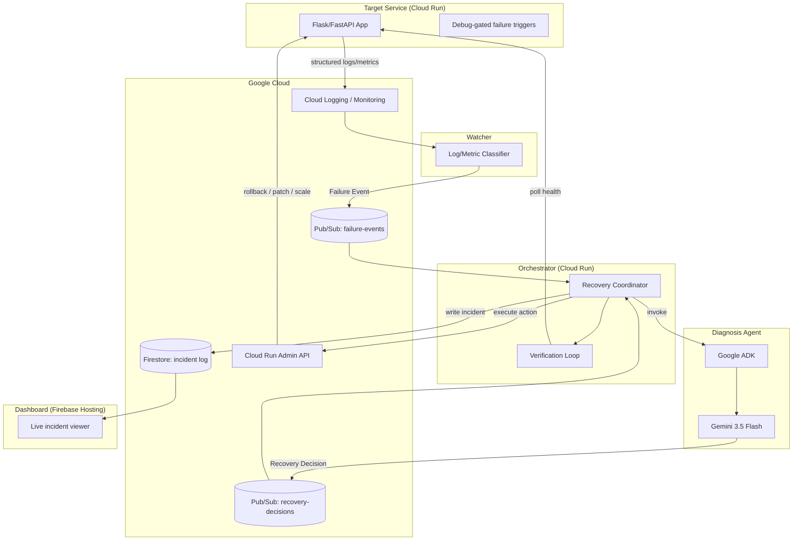
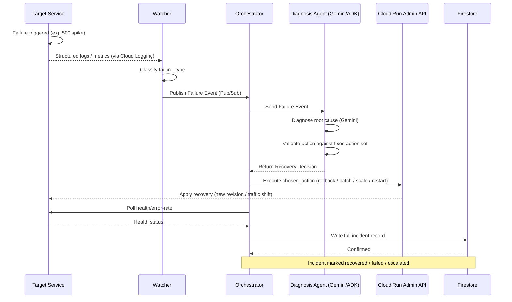

# AutoMend

**An autonomous agent that detects, diagnoses, and self-heals failing backend services — with zero human intervention.**

Built for Google's **All Things Agentic** hackathon.

AutoMend watches a live backend service running on Google Cloud Run. When it crashes, throws error spikes, leaks memory, or ships a bad deploy, AutoMend doesn't just alert a human — it diagnoses the root cause using Gemini via Google's Agent Development Kit (ADK), picks a safe recovery action from a pre-approved set, executes it against real infrastructure, verifies the fix worked, and logs the entire incident.

> `Error-rate spike detected → root cause: bad env var in latest revision → rolled back to last healthy revision → verified healthy → "recovered autonomously."`

---

## Table of Contents
- [Why AutoMend](#why-automend)
- [Architecture](#architecture)
- [Data Flow](#data-flow)
- [Tech Stack](#tech-stack)
- [Repository Structure](#repository-structure)
- [Setup Instructions (for judges)](#setup-instructions-for-judges)
- [Running the Demo](#running-the-demo)
- [Safety Design](#safety-design)
- [CI/CD](#cicd)
- [Team](#team)
- [Roadmap](#roadmap)

---

## Why AutoMend
Backend services fail in recurring, diagnosable ways: crash loops, 5xx spikes, memory leaks, bad deploys, broken config. Today, recovery means someone gets paged, reads logs, and manually fixes it. AutoMend closes that loop autonomously — it doesn't just explain what went wrong, it **takes responsibility for fixing it.**

---

## Architecture

Three independently deployable services, connected only through two fixed message contracts.



---

## Data Flow



### Message Contracts

**Failure Event** (Watcher → Orchestrator)
```json
{
  "service_id": "string",
  "revision_id": "string",
  "timestamp": "ISO8601",
  "failure_type": "crash_loop | error_rate_spike | memory_leak | bad_deploy | health_check_failure | dependency_failure",
  "log_snippet": "string",
  "metrics": { "error_rate": 0.0, "memory_mb": 0, "restart_count": 0 },
  "last_known_good_revision": "string"
}
```

**Recovery Decision** (Diagnosis Agent → Orchestrator)
```json
{
  "service_id": "string",
  "diagnosed_cause": "string",
  "confidence": 0.0,
  "chosen_action": "rollback_to_last_good | patch_env_var | increase_memory_limit | restart_instance | scale_down_instance",
  "action_params": { "target_revision": "string", "env_key": "string", "env_value": "string", "memory_mb": 512 },
  "reasoning": "string"
}
```

`chosen_action` is a closed enum, enforced by a validation layer — the model can reason freely, but can never trigger an action outside this pre-approved set.

---

## Tech Stack

| Layer | Technology |
|---|---|
| Backend (all services) | Python 3.11, FastAPI |
| AI reasoning | Gemini 3.5 Flash via Google Agent Development Kit (ADK) |
| Compute | Google Cloud Run |
| Messaging | Google Cloud Pub/Sub |
| State / audit log | Google Firestore |
| Monitoring source | Google Cloud Logging, Google Cloud Monitoring |
| Infra control plane | Cloud Run Admin API |
| Dashboard | Static HTML/CSS/JS on Firebase Hosting, reading Firestore directly (read-only) |
| Containerization | Docker |
| CI/CD | GitHub Actions → `gcloud run deploy --source .` on push to `main` |

---

## Repository Structure
```
automend/
├── services/
│   ├── target-service/       # Buggy Flask/FastAPI app + failure triggers
│   ├── watcher/               # Log/metric classifier, publishes Failure Events
│   ├── diagnosis-agent/       # Gemini + ADK decision service
│   └── orchestrator/          # Recovery execution, verification, Firestore writes
├── dashboard/                  # Static incident viewer (Firebase Hosting)
├── .github/workflows/          # Per-service deploy workflows
├── docs/
│   └── architecture.md
└── README.md
```

---

## Setup Instructions (for judges)

### Prerequisites
- A Google Cloud project with billing enabled
- `gcloud` CLI installed and authenticated (`gcloud auth login`)
- Docker installed
- A Firebase project linked to the same GCP project (for the dashboard)
- Gemini API access enabled in the GCP project

### 1. Clone and configure
```bash
git clone https://github.com/<your-org>/automend.git
cd automend
cp .env.example .env
# Fill in: GCP_PROJECT_ID, GCP_REGION, GEMINI_API_KEY
```

### 2. Enable required GCP APIs
```bash
gcloud services enable run.googleapis.com \
  pubsub.googleapis.com \
  firestore.googleapis.com \
  logging.googleapis.com \
  monitoring.googleapis.com \
  aiplatform.googleapis.com
```

### 3. Provision infra
```bash
# Pub/Sub topics
gcloud pubsub topics create failure-events
gcloud pubsub topics create recovery-decisions

# Firestore (Native mode)
gcloud firestore databases create --region=<GCP_REGION>
```

### 4. Deploy each service
```bash
# Target (buggy) service
gcloud run deploy automend-target --source ./services/target-service --allow-unauthenticated

# Watcher
gcloud run deploy automend-watcher --source ./services/watcher

# Diagnosis Agent
gcloud run deploy automend-diagnosis --source ./services/diagnosis-agent --set-env-vars GEMINI_API_KEY=$GEMINI_API_KEY

# Orchestrator
gcloud run deploy automend-orchestrator --source ./services/orchestrator --allow-unauthenticated
```

### 5. Deploy the dashboard
```bash
cd dashboard
firebase deploy --only hosting
```

### 6. Verify
Visit the printed Cloud Run URL for `automend-target` to confirm the app is live, and the Firebase Hosting URL to confirm the dashboard loads (it will be empty until an incident occurs).

---

## Running the Demo
1. Open the target service's `/break` endpoint (or trigger a bad deploy via the provided script in `services/target-service/triggers/`) to force a failure.
2. Watch the dashboard — within seconds, an incident should appear: failure detected → diagnosis reasoning → recovery action taken → verification result.
3. Confirm the target service is healthy again by hitting its normal endpoint.

A full walkthrough script is in `docs/demo-script.md`; a recorded run is linked in the submission video.

---

## Safety Design
- The diagnosis agent's output is constrained to a fixed, pre-approved action enum — never free-form commands.
- Every action is validated before execution; invalid output falls back to a deterministic rule (e.g., crash loop → rollback) rather than being executed or dropped.
- Every recovery is verified post-execution; a failed verification is marked `escalated`, not retried indefinitely — this prevents recovery loops.
- Only the Orchestrator holds infrastructure credentials. The LLM never has direct access to the Cloud Run Admin API.

---

## CI/CD
Each service has a minimal GitHub Actions workflow (`.github/workflows/`) that deploys to Cloud Run on push to `main` via `gcloud run deploy --source .`. This keeps every merge to `main` a working, deployed "last known good" revision — which is also literally the mechanism AutoMend uses to recover the target service, so the pipeline doubles as the rollback source of truth.

---

## Team
Built by a 3-person team for Google's All Things Agentic hackathon:
- **Person A** — Target service & failure detection (Watcher)
- **Person B** — Diagnosis agent (Gemini + ADK)
- **Person C** — Orchestration, recovery execution, infrastructure, and reporting

---

## Roadmap
- MCP-based tool integration for heterogeneous infra beyond Cloud Run
- AWS CloudWatch support for multi-cloud monitoring
- PagerDuty escalation when the agent can't safely auto-recover
- Slack integration for real-time incident notification and human override

---

## License
MIT
