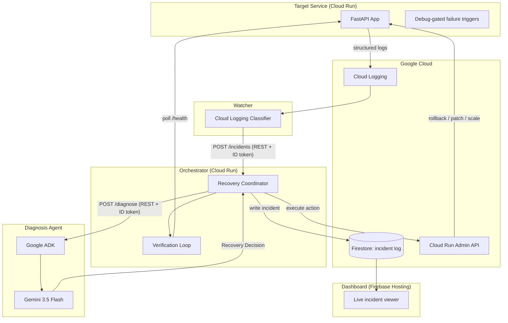
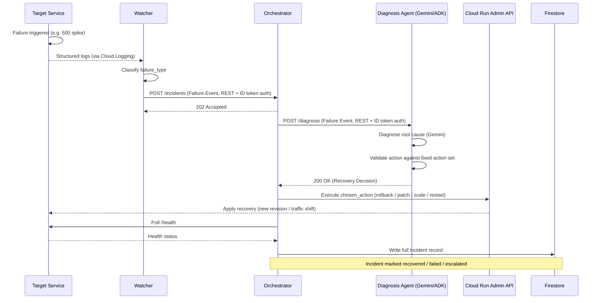

# AutoMend

**An autonomous agent that detects, diagnoses, and self-heals failing backend services — with zero human intervention.**

Built for Google's **All Things Agentic** hackathon.

AutoMend watches a live backend service running on Google Cloud Run. When it crashes, throws error spikes, leaks memory, or ships a bad deploy, AutoMend doesn't just alert a human — it diagnoses the root cause using Gemini via Google's Agent Development Kit (ADK), picks a safe recovery action from a pre-approved set, executes it against real infrastructure, verifies the fix worked, and logs the entire incident.

> `Error-rate spike detected → root cause: bad env var in latest revision → rolled back to last healthy revision → verified healthy → "recovered autonomously."`

---

## Table of Contents
- [Why AutoMend](#why-automend)
- [Architecture](#architecture)
- [Data Flow](#data-flow)
- [Tech Stack](#tech-stack)
- [Repository Structure](#repository-structure)
- [Live Deployment](#live-deployment)
- [Running the Demo](#running-the-demo)
- [Safety Design](#safety-design)
- [CI/CD](#cicd)
- [Known Issues & Fixes Applied](#known-issues--fixes-applied)
- [Team](#team)
- [Roadmap](#roadmap)

---

## Why AutoMend
Backend services fail in recurring, diagnosable ways: crash loops, 5xx spikes, memory leaks, bad deploys, broken config. Today, recovery means someone gets paged, reads logs, and manually fixes it. AutoMend closes that loop autonomously — it doesn't just explain what went wrong, it **takes responsibility for fixing it.**

---

## Architecture

Three independently deployable Cloud Run services, connected only through two fixed REST API contracts — no message broker, every hop is a direct synchronous HTTP call.



---

## Data Flow



### Message Contracts

Both are REST request/response bodies — there is no message broker in the system.

**Failure Event** (Watcher → Orchestrator, `POST /incidents` request body)
```json
{
  "service_id": "string",
  "revision_id": "string",
  "timestamp": "ISO8601",
  "failure_type": "crash_loop | error_rate_spike | memory_leak | bad_deploy | health_check_failure | dependency_failure",
  "log_snippet": "string",
  "metrics": { "error_rate": 0.0, "memory_mb": 0, "restart_count": 0 },
  "last_known_good_revision": "string"
}
```

**Recovery Decision** (Diagnosis Agent → Orchestrator, `POST /diagnose` response body)
```json
{
  "service_id": "string",
  "diagnosed_cause": "string",
  "confidence": 0.0,
  "chosen_action": "rollback_to_last_good | patch_env_var | increase_memory_limit | restart_instance | scale_down_instance",
  "action_params": { "target_revision": "string", "env_key": "string", "env_value": "string", "memory_mb": 512 },
  "reasoning": "string"
}
```

`chosen_action` is a closed enum, enforced by a validation layer — the model can reason freely, but can never trigger an action outside this pre-approved set.

---

## Tech Stack

| Layer | Technology |
|---|---|
| Backend (all services) | Python 3.11, FastAPI |
| AI reasoning | Gemini 3.5 Flash via Google Agent Development Kit (ADK) |
| Compute | Google Cloud Run |
| Inter-service communication | REST/HTTP, Cloud Run service-to-service auth (ID tokens + `roles/run.invoker`) |
| State / audit log | Google Firestore (Native mode) |
| Monitoring source | Google Cloud Logging |
| Infra control plane | Cloud Run Admin API (v2 Python client) |
| Dashboard | Static HTML/CSS/JS on Firebase Hosting, reading Firestore directly (read-only) |
| Containerization | Docker |
| CI/CD | GitHub Actions → `gcloud run deploy --source .` on push to `main` |

---

## Repository Structure
```
AutoMend/
├── services/
│   ├── target-service/       # Buggy FastAPI app + debug-gated failure triggers
│   ├── watcher/              # Cloud Logging classifier → publishes Failure Events
│   ├── diagnosis-agent/      # Gemini + ADK decision service
│   └── orchestrator/         # Recovery execution, verification, Firestore writes
├── dashboard/                # Static incident viewer (Firebase Hosting)
├── scripts/
│   └── setup-gcp.sh          # One-shot GCP provisioning script
├── .github/workflows/        # Per-service deploy workflows
├── docs/
│   ├── architecture.md       # Full technical reference
│   ├── deployment-guide.md   # Step-by-step deployment instructions
│   ├── demo-script.md        # Demo walkthrough
│   ├── demo-hardening.md     # Demo reliability notes
│   └── person-a-handoff.md   # Person A integration guide
├── .env.example              # Environment variable template
└── README.md                 # This file
```

---

## Live Deployment

All four services are deployed and verified on Google Cloud Run (project: `automend-hackathon`, region: `us-central1`):

| Service | URL | Status |
|---|---|---|
| Target Service | `https://automend-target-247530183292.us-central1.run.app` | ✅ Deployed, DEBUG_MODE=true |
| Watcher | `https://automend-watcher-247530183292.us-central1.run.app` | ✅ Deployed, MOCK_MODE=false |
| Diagnosis Agent | `https://automend-diagnosis-247530183292.us-central1.run.app` | ✅ Deployed |
| Orchestrator | `https://automend-orchestrator-247530183292.us-central1.run.app` | ✅ Deployed, DISABLE_AUTH=false |

**Dashboard:** Firebase Hosting (see Firebase Console for URL)

**Service Accounts:**
| Account | Roles |
|---|---|
| `automend-orchestrator@...` | `roles/run.admin`, `roles/datastore.user`, `roles/artifactregistry.reader`, `roles/iam.serviceAccountUser` |
| `automend-watcher@...` | `roles/logging.viewer`, `roles/monitoring.viewer` + `roles/run.invoker` on orchestrator |
| `automend-diagnosis@...` | (none on project level; orchestrator invokes it via `roles/run.invoker`) |

---

## Running the Demo

### Prerequisites
- `gcloud` CLI authenticated (`gcloud auth login`)
- All four services deployed (see Live Deployment above)
- Firebase project linked for dashboard

### Step-by-step demo
1. **Show healthy state:** `curl https://automend-target-247530183292.us-central1.run.app/health` → `{"status": "ok"}`
2. **Trigger failure:** `curl -X POST https://automend-target-247530183292.us-central1.run.app/debug/error-spike`
3. **Wait 10-15 seconds** for the Watcher to detect, classify, and dispatch to Orchestrator
4. **Watch dashboard** — incident appears: `received` → `diagnosing` → `action_taken` → `verifying` → `recovered`/`escalated`
5. **Verify recovery:** `curl https://automend-target-247530183292.us-central1.run.app/health`
6. **Reset:** `curl -X POST https://automend-target-247530183292.us-central1.run.app/debug/reset`

### Available failure triggers
```bash
# Error rate spike (500s on all non-health endpoints)
curl -X POST https://automend-target-247530183292.us-central1.run.app/debug/error-spike

# Memory leak (allocates MB until OOM)
curl -X POST https://automend-target-247530183292.us-central1.run.app/debug/leak-memory

# Health check hang (requests stall past probe timeout)
curl -X POST https://automend-target-247530183292.us-central1.run.app/debug/hang

# Crash loop (process exits, restarts in crash loop)
curl -X POST https://automend-target-247530183292.us-central1.run.app/debug/crash

# Reset all failure states
curl -X POST https://automend-target-247530183292.us-central1.run.app/debug/reset
```

---

## Safety Design
- **Closed action space:** the Diagnosis Agent can only select from five pre-approved actions; nothing outside that enum can be executed.
- **Validated execution:** every decision is validated before the Orchestrator acts on it; invalid output falls back to a deterministic rule.
- **Verified outcomes:** every recovery action is followed by a verification window; a failed verification is marked `escalated`, not retried automatically.
- **Least-privilege execution:** only the Orchestrator holds infrastructure credentials. The LLM never has direct access to the Cloud Run Admin API.
- **Idempotency:** the Orchestrator checks for an in-progress incident for a given `service_id` before acting, so retried calls don't trigger duplicate recovery attempts.

---

## CI/CD
Each service has a GitHub Actions workflow (`.github/workflows/`) that deploys to Cloud Run on push to `main` via `gcloud run deploy --source .`. The orchestrator workflow uses `--min-instances=0` for zero cost when idle.

---

## Known Issues & Fixes Applied

### Bugs fixed during integration testing
1. **Watcher couldn't detect failures** — `gcp_client.py` wasn't unwrapping `jsonPayload` from Cloud Logging entries, so `status_code`/`event_type` fields were nested and invisible to the classifier.
2. **Recovery actions failed with "Unknown field for Service: spec"** — `recovery.py` used `template.spec.containers` which doesn't exist in the Cloud Run v2 API. Fixed to `template.containers`.
3. **Orchestrator couldn't call Diagnosis Agent** — `decision_client.py` made unauthenticated HTTP calls against a `--no-allow-unauthenticated` service. Added OIDC ID token auth.
4. **Firestore query crash** — `get_active_incident` used `.where().order_by()` requiring a composite index that takes minutes to build. Simplified to `.where().limit()`.
5. **Empty watcher Dockerfile** — A's Dockerfile was empty; container crashed on startup.
6. **Watcher imported from tests/** — `gcp_client.py` imported `MOCK_SCENARIOS` from `tests.mock_data` which doesn't exist in the container image. Inlined the mock data.
7. **Missing `__init__.py` files** — Orchestrator and diagnosis-agent packages lacked `__init__.py`, causing import failures.

### IAM permissions required (added during integration)
- `roles/artifactregistry.reader` on orchestrator SA (to pull images when deploying new revisions)
- `roles/iam.serviceAccountUser` on orchestrator SA (to act as target service's SA during deploys)
- `roles/run.invoker` cross-service bindings (watcher→orchestrator, orchestrator→diagnosis)

---

## Team
Built by a 3-person team for Google's All Things Agentic hackathon:
- **Person A** — Target Service & Watcher (failure detection)
- **Person B** — Diagnosis Agent (Gemini + ADK)
- **Person C** — Orchestrator, Infrastructure, Dashboard (recovery execution)

---

## Roadmap
- MCP-based tool integration for heterogeneous infra beyond Cloud Run
- AWS CloudWatch support for multi-cloud monitoring
- PagerDuty escalation when the agent can't safely auto-recover
- Slack integration for real-time incident notification and human override

---

## License
MIT
