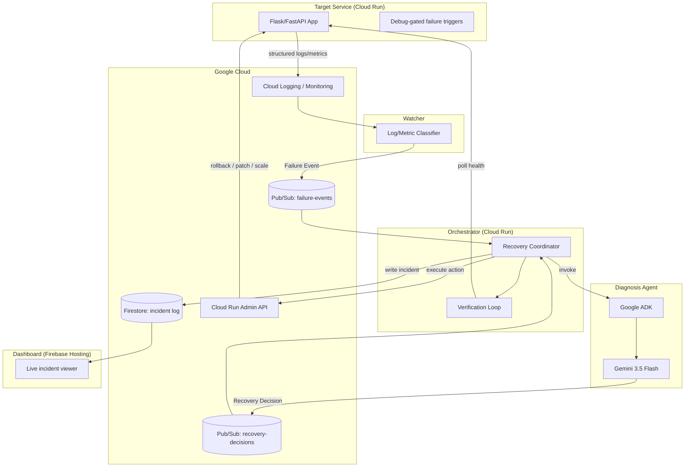
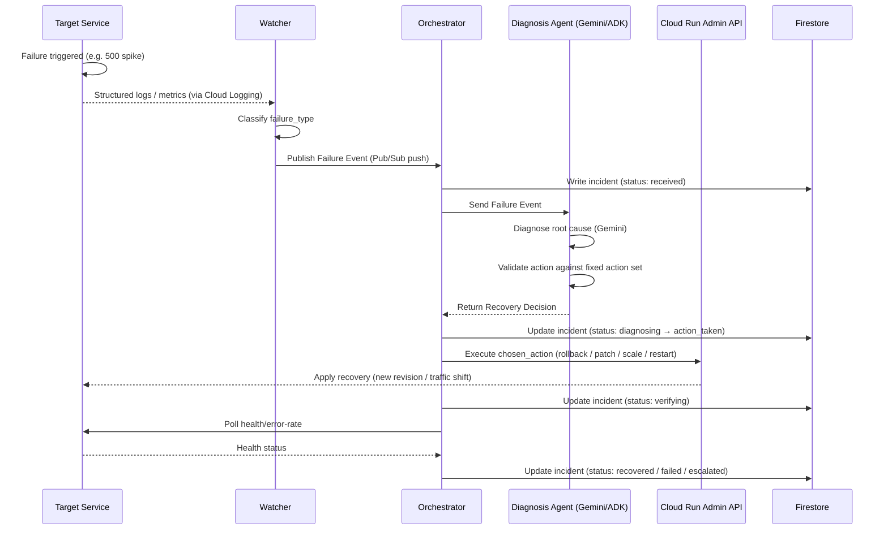

# AutoMend — Architecture

This document is the canonical technical reference for the system. The README links here for anyone (judges, contributors) who wants the full picture beyond the top-level overview.

## 1. Overview
AutoMend is composed of three independently deployable Cloud Run services plus a static dashboard, communicating only through two fixed, versioned message contracts. This document describes the components, the data flow between them, the exact contracts, the data model, and the safety properties of the system.

## 2. Components

### 2.1 Target Service (`services/target-service`)
A small Flask/FastAPI application deployed on Cloud Run, instrumented with structured (JSON-line) logging and a set of debug-gated endpoints that trigger specific failure conditions on demand:
- Forced 5xx error loop (`error_rate_spike`)
- Memory allocation until OOM-kill (`memory_leak`)
- A deliberately broken revision, deployed separately (`bad_deploy`)
- A hang/stall endpoint exceeding the readiness probe timeout (`health_check_failure`)

### 2.2 Watcher (`services/watcher`)
A polling process (Cloud Run job or scheduled Cloud Function) that queries Cloud Logging and Cloud Monitoring for the target service. It applies rule-based classifiers per failure type and, on a positive match, publishes a **Failure Event** to the `failure-events` Pub/Sub topic.

### 2.3 Diagnosis Agent (`services/diagnosis-agent`)
A stateless decision service built on Google's Agent Development Kit (ADK), using Gemini 3.5 Flash as the reasoning model. It receives a Failure Event, constructs a diagnosis prompt (failure type, log snippet, metrics, last known good revision), and returns a structured **Recovery Decision** via ADK's structured output/function-calling. A validation layer rejects any `chosen_action` outside the fixed enum and falls back to a deterministic rule.

### 2.4 Orchestrator (`services/orchestrator`)
The coordinator, and the only component with write access to infrastructure. It:
- Receives Failure Events via a Pub/Sub **push subscription** (not pull — Cloud Run scales to zero, so push is the correct delivery model here).
- Calls the Diagnosis Agent and receives a Recovery Decision.
- Executes the decision against the target service via the **Cloud Run Admin API**.
- Verifies the outcome by polling health/error-rate for a short window.
- Writes the full incident lifecycle to Firestore.

### 2.5 Dashboard (`dashboard/`)
A static HTML/CSS/JS site on Firebase Hosting that reads Firestore directly (read-only) via the Firebase JS SDK. No backend of its own.

## 3. Architecture Diagram



## 4. Data Flow / Sequence



## 5. Message Contracts

These two schemas are the only coupling between A's, B's, and C's components. Treat them as frozen once agreed — any change requires a 3-way sync.

### 5.1 Failure Event (Watcher → Orchestrator)
```json
{
  "service_id": "string",
  "revision_id": "string",
  "timestamp": "ISO8601",
  "failure_type": "crash_loop | error_rate_spike | memory_leak | bad_deploy | health_check_failure | dependency_failure",
  "log_snippet": "string (last ~50 lines)",
  "metrics": {
    "error_rate": 0.0,
    "memory_mb": 0,
    "restart_count": 0
  },
  "last_known_good_revision": "string"
}
```

### 5.2 Recovery Decision (Diagnosis Agent → Orchestrator)
```json
{
  "service_id": "string",
  "diagnosed_cause": "string",
  "confidence": 0.0,
  "chosen_action": "rollback_to_last_good | patch_env_var | increase_memory_limit | restart_instance | scale_down_instance",
  "action_params": {
    "target_revision": "string",
    "env_key": "string",
    "env_value": "string",
    "memory_mb": 512
  },
  "reasoning": "string (1-2 sentences)"
}
```

`chosen_action` is a closed enum. The Diagnosis Agent may reason freely, but its output is validated before execution, and any value outside this set is rejected in favor of a deterministic fallback rule.

## 6. Data Model (Firestore)

```
services/{service_id}
    status: string
    current_revision: string
    start_time: timestamp

services/{service_id}/incidents/{incident_id}
    failure_event: map          # full Failure Event payload
    recovery_decision: map      # full Recovery Decision payload
    action_taken: map           # action + params actually executed
    verification_result: map
    outcome: "recovered" | "failed" | "escalated"
    status: "received" | "diagnosing" | "action_taken" | "verifying" | "recovered" | "failed" | "escalated"
    timestamps: map             # per-stage timestamps, for latency measurement
```

Incident documents are written incrementally — status is updated at each stage rather than in a single write at the end — so a crash mid-incident still leaves a usable partial record, and the dashboard can show incidents in progress in real time.

## 7. Safety Design
- **Closed action space:** the Diagnosis Agent can only select from five pre-approved actions; nothing outside that enum can be executed.
- **Validated execution:** every decision is validated before the Orchestrator acts on it; invalid output falls back to a deterministic rule rather than being executed or silently dropped.
- **Verified outcomes:** every recovery action is followed by a verification window; a failed verification is marked `escalated`, not retried automatically, which prevents recovery loops against infrastructure that can't be fixed by the available actions.
- **Least-privilege execution:** only the Orchestrator holds credentials capable of modifying infrastructure (via the Cloud Run Admin API). The Diagnosis Agent never has direct infrastructure access — it only returns a decision.
- **Idempotency:** Pub/Sub delivery is at-least-once. The Orchestrator checks for an in-progress incident for a given `service_id` before acting, so redelivered or duplicate Failure Events don't trigger conflicting recovery attempts.

## 8. Technology Stack

| Layer | Technology |
|---|---|
| Backend (all services) | Python 3.11, FastAPI |
| AI reasoning | Gemini 3.5 Flash via Google Agent Development Kit (ADK) |
| Compute | Google Cloud Run |
| Messaging | Google Cloud Pub/Sub (push subscriptions) |
| State / audit log | Google Firestore |
| Monitoring source | Google Cloud Logging, Google Cloud Monitoring |
| Infra control plane | Cloud Run Admin API |
| Dashboard | Static HTML/CSS/JS on Firebase Hosting, reading Firestore directly (read-only) |
| Containerization | Docker |
| CI/CD | GitHub Actions → `gcloud run deploy --source .` on push to `main` |

## 9. Future Extensions
- MCP-based tool integration in place of direct API calls, for heterogeneous infrastructure beyond Cloud Run.
- AWS CloudWatch as an additional monitoring source for multi-cloud coverage.
- PagerDuty integration for escalation when the agent cannot safely auto-recover.
- Slack integration for real-time incident notification and human-in-the-loop override.